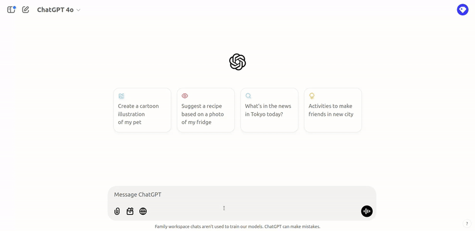

# gpt-to-obsidian

A Web App to convert a ChatGPT file to an Obsidian one.

This project is designed to help users easily transform files created by ChatGPT into a format compatible with the note-taking app Obsidian.

## Features
- Convert ChatGPT files into Obsidian-compatible files.
- Simple and user-friendly interface.
- Dark/Light mode

## Demo

Below is a demonstration of how the application works:

  

## License 
This project is licensed under the Apache-2.0 License. See the LICENSE file for details.

---

### How to Use
1. Clone this repository: `git clone https://github.com/SeldonAi/gpt-to-obsidian.git`
2. Open the web application `converter.html` in your preferred browser (Not open with a IDE or notebook).
3. Paste your ChatGPT file in the text area and click the botton convert and then copy to copy it.

---

### Author
Created by SeldonAI.
